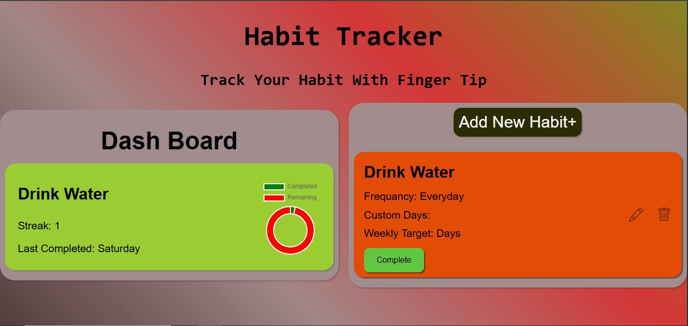

# Habit Tracker App - Manage Your Habit Finger Tip
Fully Customized Habit tracking App crated by JavaScript and HTML and responsive UI using CSS.

##features
-> Add Hbit with modal.
-> Select you frequncy for maintain your habit.
-> Add (Daily, Weekly, Custom Frequancy).
-> DashBoard Available for your progress.
-> Have chart for your progess(using chart.js)
-> Complete your habit your frequancy based.
-> Instant UI update.
-> Edit Habit.
-> Delete Habit.


## 🛠 Tech Stack

- HTML
- Vanila.js
- CSS

## Live Demo
Not Available.

## ScreenShot



## Personal Note
Git commit history is not available for this project because it was developed on a low-end system.
Running Git or Git Extensions in VS Code significantly slowed down the editor, often causing it to hang.
As a result, version control was managed manually outside of VS Code for this project.


## 🚀 Run Locally

Clone the project:

```bash
git clone https://github.com/tousher101/Habit-Tracker.git
cd Habit-Tracker

#Then, simply open index.html in your browser.


